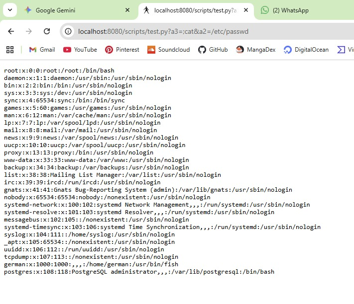
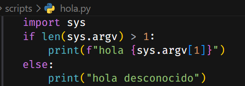

# Diseño del Servidor HTTP en C

## 1. Introducción

Este documento describe la arquitectura y el diseño del servidor HTTP implementado en C. El servidor es un sistema multi-proceso que maneja peticiones HTTP/1.1 y HTTP/1.0, soporta ejecución de scripts, gestión de archivos estáticos, APIs externas y operaciones RESTful básicas.

## 2. Vista General de Módulos

El servidor está estructurado en módulos claramente diferenciados, cada uno con una responsabilidad específica:

### 2.1 Módulos Principales

| Módulo | Descripción |
|--------|-------------|
| **net_lib** | Gestión de sockets y red. Encargado de abrir el servidor, aceptar conexiones y crear descriptores de archivo para comunicación. |
| **http_parser** | Análisis de peticiones HTTP. Parsea la línea de solicitud, extrae argumentos URL, sanitiza rutas y procesa cabeceras. |
| **http_utils** | Utilidades HTTP. Manejo de tipos de contenido, formateo de fechas, construcción y envío de respuestas. |
| **conf** | Configuración. Lee el archivo de configuración y establece los parámetros del servidor. |
| **concurrency** | Concurrencia. Implementa el modelo de pool de procesos prefork para manejar múltiples clientes simultáneamente. |
| **file_handler** | Gestión de archivos. Serve archivos estáticos, ejecuta scripts, modifica y elimina archivos según el método HTTP. |
| **api_client** | Cliente API. Realiza llamadas a APIs externas y sirve las respuestas a los clientes. |
| **scripts** | Ejecución de scripts. Wrapper para ejecutar scripts CGI-like (Python, PHP) y capturar su salida. |

### 2.2 Flujo de Datos entre Módulos

```
Cliente → net_lib (accept) → http_parser (parse) → server (route)
                                                              ↓
                                              ┌───────────────┼───────────────┐
                                              ↓               ↓               ↓
                                        file_handler   api_client         scripts
                                              ↓               ↓               ↓
                                              └───────────────┼───────────────┘
                                                              ↓
                                              http_utils (build response)
                                                              ↓
                                              net_lib (send) → Cliente
```

## 3. Arquitectura del Servidor

### 3.1 Modelo de Concurrencia: Pool Estático de Procesos (Pre-fork)

El servidor utiliza un modelo de concurrencia basado en un **pool estático de procesos prefork**. Este modelo fue elegido por su simplicidad y robustez ante ataques de denegación de servicio (DoS).

```
┌─────────────────────────────────────────────────────────────┐
│                      PROCESO PADRE                          │
│  ┌─────────────┐    ┌─────────────┐    ┌─────────────┐      │
│  │  Logger     │    │  Accept     │    │  Manager    │      │
│  │  Process    │    │  Loop       │    │  Children   │      │
│  └─────────────┘    └─────────────┘    └─────────────┘      │
│         ↑                  ↑                  ↑             │
│         │                  │                  │             │
│    pipe(log)          pipe(ctl)         fork() x N          │
└─────────────────────────────────────────────────────────────┘
         │                                       │
         │         ┌─────────────────────────────┤
         │         │         PROCESOS HIJOS      │
         ▼         ▼                             ▼
    ┌─────────┐ ┌─────────┐               ┌─────────┐
    │Worker 1 │ │Worker 2 │  ...          │Worker N │
    │(connfd) │ │(connfd) │               │(connfd) │
    └─────────┘ └─────────┘               └─────────┘
```

### 3.2 Características del Modelo

- **Inicio**: El proceso padre crea N procesos hijos (workers) al inicio, basados en `max_clients`.
- **Distribución**: Cada hijo comparte el mismo socket de escucha (`listenfd`) y compite por aceptar conexiones.
- **Aislamiento**: Cada proceso hijo maneja una conexión independiente, proporcionando aislamiento de fallos.
- **Limitación**: El número máximo de clientes simultáneos está limitado por el pool, previniendo ataques DoS.
- **Logging**: Un proceso dedicado (logger) captura logs de todos los workers a través de un pipe.

Durante el arranque del servidor, el módulo `concurrency.c` crea un número fijo de procesos hijos definido por el parámetro `max_clients` en el archivo de configuración. Estos procesos se crean utilizando la llamada al sistema `fork()`.

Todos los procesos hijos comparten el mismo descriptor de socket de escucha (`listenfd`). Tras ser creados, cada proceso entra en un bucle infinito donde espera nuevas conexiones entrantes mediante la llamada al sistema `accept()`.

Cuando un cliente se conecta:

1. El kernel despierta a uno de los procesos bloqueados en `accept()`.
2. Ese proceso acepta la conexión y obtiene un nuevo descriptor de conexión (`connfd`).
3. El proceso ejecuta el `handler`, que contiene la lógica del servidor para procesar la petición HTTP.
4. Una vez enviada la respuesta, el proceso cierra la conexión y vuelve a bloquearse en `accept()` esperando nuevas solicitudes.

Este modelo permite atender múltiples clientes de forma concurrente, ya que cada proceso puede gestionar una conexión independiente.

Además, el servidor crea un proceso adicional encargado exclusivamente del **registro de logs**. Los procesos trabajadores envían las entradas de log a este proceso mediante un **pipe**, evitando así que múltiples procesos escriban simultáneamente en el mismo archivo.

El proceso padre no gestiona directamente las conexiones. Tras crear los procesos hijos y el proceso de logging, permanece en estado de espera (`pause()`), limitándose a gestionar señales del sistema (por ejemplo `SIGINT`) para realizar una terminación ordenada del servidor y liberar los recursos.

### 3.3 Ciclo de Vida del Servidor

El flujo de arranque del servidor es el siguiente:

1. **server.c** solicita a **conf.c** que parsee las configuraciones de `server.conf` (o de la ruta indicada en `argv[1]`).
2. Con la configuración lista, se invoca **concurrency.c** para crear los procesos hijos encargados de escuchar en el socket creado por **net_lib**.

El código de entrada de los hijos workers es:

```c
static void child_main(int listenfd, request_handler_t handler, server_config *sc, int pipe[2])
{
    for (;;)
    {
        int connfd = accept_connection(listenfd);

        if (connfd >= 0)
        {
            handler(connfd, sc, pipe); // Ejecuta la lógica delegada
            close(connfd);              // Cierra la conexión específica
        }
    }
}
```

El primer hijo libre atiende la conexión y llama a `handler` (definido en el módulo de **servidor**). Dentro de `handler` se parsean los datos de la conexión con **http_parser** y se devuelve una estructura con la petición. El servidor decide entonces cómo interpretar la solicitud:

- Si es `POST` en `scripts/` → ejecuta un archivo con **scripts**.
- Si es `GET` en `api/` → procesa la petición con **api_client**.
- Si es `GET` normal → sirve el archivo correspondiente.
- Y otras rutas/métodos según la lógica definida.

Finalmente, según la decisión tomada, se invoca una función de **file_handler** que realiza comprobaciones y construye la respuesta (éxito o error) usando **http_utils**, el cual a su vez se apoya en **net_lib** para enviar bytes por el socket.

## 4. Flujo de una Petición HTTP

El servidor sigue un flujo estructurado para procesar cada petición:

### 4.1 Fase de Conexión

```
1. El cliente establece conexión TCP al servidor
2. El proceso hijo acepta la conexión (accept_connection)
3. Se obtiene un descriptor de socket (connfd) único para esta conexión
```

### 4.2 Fase de Parsing

```
4. Se recibe el buffer HTTP mediante recv()
5. Se parsea la línea de solicitud (método, URI, versión)
6. Se validan los argumentos URL y se sanitiza la ruta
7. Para POST/PUT: se parsean las cabeceras y el body
```

### 4.3 Fase de Enrutamiento

```
8. Se determina el tipo de petición:
   - Si ruta API → api_client
   - Si carpeta scripts → execute_file (scripts)
   - Si GET/HEAD → serve_file (archivos estáticos)
   - Si PUT/DELETE → modify_file/delete_file (carpeta compartida)
   - Si OPTIONS → send_options
```

### 4.4 Fase de Respuesta

```
9. Se construyen las cabeceras HTTP (set_content_type, send_headers)
10. Se envía el contenido (archivo, salida de script, respuesta API)
11. Se registra la petición en el log
12. Se cierra la conexión (close(connfd))
```

## 5. Métodos HTTP Soportados

El servidor implementa los siguientes métodos HTTP:

| Método | Descripción | Restricciones |
|--------|-------------|---------------|
| **GET** | Recupera recursos del servidor | Archivos en `server_root` |
| **HEAD** | Igual que GET pero sin cuerpo | Solo cabeceras |
| **POST** | Envía datos para procesamiento | Scripts en `scripts_directory` |
| **PUT** | Crea o reemplaza un recurso | Solo en `shared_directory` |
| **DELETE** | Elimina un recurso | Solo en `shared_directory` |
| **OPTIONS** | Consulta métodos permitidos | Respuesta CORS |

### 5.1 Comportamiento por Método

- **GET**: Busca el archivo en `server_root`, determina tipo MIME, envía contenido.
- **HEAD**: Igual que GET pero solo envía cabeceras (no cuerpo).
- **POST**: Ejecuta script en `scripts_directory`, pasa argumentos URL y body como stdin.
- **PUT**: Crea/sobrescribe archivo en `shared_directory` con el body de la petición.
- **DELETE**: Elimina archivo en `shared_directory`.
- **OPTIONS**: Retorna cabecera `Allow` con métodos soportados.

## 6. Estructura del Proyecto

```
R2-P1/
├── include/          # Ficheros de cabecera (.h)
│   ├── api_client.h
│   ├── concurrency.h
│   ├── conf.h
│   ├── file_handler.h
│   ├── http_parser.h
│   ├── http_utils.h
│   ├── net_lib.h
│   └── scripts.h
├── src/              # Código principal (.c)
│   ├── api_client.c
│   ├── concurrency.c
│   ├── conf.c
│   ├── file_handler.c
│   ├── scripts.c
│   └── server.c      # Punto de entrada
├── srclib/           # Biblioteca interna
│   ├── http_parser.c
│   ├── http_utils.c
│   └── net_lib.c
├── lib/              # Biblioteca estática compilada
├── obj/              # Ficheros objeto compilados
├── www/              # Raíz del servidor (archivos estáticos)
├── scripts/          # Directorio para scripts ejecutables
├── shared/           # Directorio para archivos compartidos (PUT/DELETE)
├── logs/             # Directorio para logs
├── outputs/          # Directorio temporal para salidas
├── server.conf       # Fichero de configuración
├── Makefile          # Sistema de construcción
└── tests/            # Pruebas unitarias
```

## 7. Seguridad

### 7.1 Medidas Implementadas

1. **Sanitización de rutas**: Se eliminan secuencias `..` para prevenir directory traversal attacks.
   ```c
   // Ejemplo: /../../../etc/passwd → se bloquea
   ```

2. **Validación de argumentos**: Solo se permiten caracteres alfanuméricos, puntos, guiones y guiones bajos en argumentos URL.

3. **Restricción de scripts**: Solo se ejecutan scripts ubicados en `scripts_directory`.

4. **Restricción de escritura**: PUT y DELETE solo operan en `shared_directory`.

5. **Límite de memoria**: El parser tiene un límite de 8KB para peticiones.

### 7.2 Ejemplos de Vulnerabilidades y Mitigaciones

El servidor no utiliza librerías externas como `picohttpparser`, por lo que el parseo se implementa manualmente. Esto exige especial atención a vulnerabilidades comunes.

#### Path Traversal

Los navegadores suelen normalizar URLs, pero un cliente malicioso puede forzar rutas como:

```cmd
curl -X DELETE --path-as-is http://ip:8080/shared/../archivo_fuera_de_shared
```

Esto podría permitir borrar archivos fuera de la carpeta compartida. Para mitigar esto se añadió saneamiento de rutas durante el parseo. Un ejemplo de log generado ante este ataque:

```log
[Wed, 11 Mar 2026 02:30:49 GMT] "GET /../hola/hola/hola/../../../../../../index.html HTTP/1.1" 200 3858

recibido: "GET /../hola/hola/hola/../../../../../../index.html HTTP/1.1"
        path: ../hola/hola/hola/../../../../../../index.html
        path después de saneo: ./www/index.html
```

Como se puede observar, el servidor detecta y neutraliza el intento de path traversal, transformando la ruta maliciosa en una ruta válida dentro del directorio raíz.

#### Inyección de Comandos en Scripts

Al permitir pasar argumentos (vargs) o el cuerpo como stdin al ejecutar scripts, existe el riesgo de que un atacante inyecte caracteres como `;` para ejecutar comandos arbitrarios:

```
?a=;cat&b=/etc/passwd
```



La solución implementada fue restringir los argumentos a números, letras, puntos y guiones. Cualquier otro carácter se rechaza automáticamente. El servidor ignora los parámetros maliciosos y solo procesa aquellos que cumplen con los criterios de seguridad.

|Salida|Código|
|:--:|:--:|
|||

### 7.3 Cabeceras de Seguridad

El servidor incluye las siguientes cabeceras en respuestas:
- `Server`: Identificación del servidor
- `Content-Type`: Tipo MIME correcto
- `Content-Length`: Longitud del contenido
- `Last-Modified`: Fecha de modificación del recurso

## 8. Limitaciones del Servidor

### 8.1 Limitaciones Conocidas

| Limitación | Descripción |
|------------|-------------|
| **Sin TLS/SSL** | No soporta HTTPS, todas las comunicaciones son en texto plano |
| **Parser simplificado** | No soporta HTTP pipelining ni chunked transfer |
| **Sin WebSockets** | No implementa protocolo WebSocket |
| **Sin autenticación** | No implementa mecanismos de autenticación |
| **Sin compresión** | No soporta gzip ni deflate |
| **Sin cookies** | No implementa gestión de sesiones via cookies |
| **Límite de buffer** | Máximo 8KB por petición |

### 8.2 Mejoras Futuras Posibles

- Implementación de TLS/SSL
- Soporte para HTTP/2
- Sistema de autenticación
- Compresión de respuestas
- WebSockets para comunicación bidireccional
- Cacheo de archivos estáticos

## 9. Compilación del Proyecto

### 9.1 Construcción del Servidor

El proyecto se compila utilizando el **Makefile** incluido en el repositorio. Para compilar el servidor, basta con ejecutar el siguiente comando desde el directorio raíz del proyecto:

```bash
make
```

Este comando realiza las siguientes operaciones:
1. Crea el directorio `obj/` para almacenar los archivos objeto
2. Compila todos los archivos fuente (`.c`) a archivos objeto (`.o`)
3. Genera la biblioteca estática `lib/libserver.a`
4. Compila y vincula el ejecutable final `server`

Para limpiar los archivos generados:

```bash
make clean
```

Es importante que la estructura de las carpetas este creada de antemano en caso de fallo del makefile. Tanto las carpetas mencionadas como las carpetas que se definan en el `server.conf`

### 9.2 Requisitos de Directorios

**IMPORTANTE**: Es fundamental que las carpetas definidas en el archivo `server.conf` existan realmente en el sistema de archivos antes de ejecutar el servidor. El servidor depende de estas directorios para funcionar correctamente.

El archivo de configuración por defecto (`server.conf`) define las siguientes rutas que deben existir:

| Directorio | Propósito | Por defecto |
|------------|-----------|--------------|
| `www/` | Raíz del servidor para archivos estáticos | Archivos HTML, imágenes, CSS, etc. |
| `logs/` | Directorio donde se generan los archivos de log | `logs/reqs_YYYY-MM-DD_HH-MM-SS.log` |
| `scripts/` | Directorio para scripts ejecutables (Python, PHP) | Solo accesibles vía `/scripts/` |
| `shared/` | Directorio para archivos compartidos (PUT/DELETE) | Solo accesibles vía `/shared/` |

Estas rutas deben ser coherentes con la estructura del proyecto y con los valores configurados en `server.conf`. Si algún directorio no existe, el servidor generar errores al intentar acceder a él.

### 9.3 Estructura de Directorios Requerida

Antes de iniciar el servidor, asegúrese de que la estructura de directorios sea similar a:

```
R2-P1/
├── www/              #  Debe existir (archivos estáticos)
├── logs/             #  Debe existir (generado por Makefile o manualmente)
├── scripts/         #  Debe existir (scripts Python/PHP)
├── shared/          #  Debe existir (archivos PUT/DELETE)
├── outputs/         #  Debe existir (temporal para salidas de scripts)
├── server.conf      #  Archivo de configuración
└── server           #  Ejecutable (tras compilar)
```

## 10. Configuración

El servidor se configura mediante el archivo `server.conf`, que utiliza una sintaxis similar a archivos `.env`. El archivo acepta comentarios (líneas que comienzan con `#`) y líneas en blanco.

```conf
# Pueden aparecer comentarios y líneas en blanco

port=8080
backlog=30
max_clients=30
server_root=www/
server_signature=servidor v1
logs_directory=logs/
scripts_directory=scripts/
shared_directory=shared/
api_route=api/
verbose=true
```

### Descripción de cada clave de configuración

| Clave | Descripción | Valor por defecto |
|-------|-------------|-------------------|
| **port** | Puerto de escucha del servidor | `8080` |
| **backlog** | Número de conexiones en cola antes de rechazar nuevas solicitudes | `10` |
| **max_clients** | Cantidad de procesos hijos creados (workers) | `10` |
| **server_root** | Raíz desde la que se sirven archivos estáticos | `www/` |
| **server_signature** | Valor de la cabecera HTTP `Server` | `webserver german ruben - 1.0` |
| **logs_directory** | Carpeta donde se generan los archivos de registro | `logs/` (relativo al directorio actual) |
| **scripts_directory** | Carpeta de ejecutables permitidos. Si es vacía, se deshabilita la ejecución de scripts. Se interpreta desde `server_root` | (vacío) |
| **shared_directory** | Carpeta donde se permiten operaciones PUT y DELETE. Si es vacía, la funcionalidad está deshabilitada. Se interpreta desde `server_root` | (vacío) |
| **api_route** | Ruta para llamadas a la API propia; las rutas están definidas en `api_client.c`. Si es vacía no hay API | (vacío) |
| **verbose** | Activa trazas por consola (no afecta a los logs) | `false` |

> **Nota de seguridad**: Si no defines `shared_directory`, `scripts_directory` o `api_route`, el servidor deshabilita estas funcionalidades para reducir la superficie de riesgo.

## 11. Conclusión

El servidor HTTP implementado proporciona una base sólida para un servidor web básico con soporte para archivos estáticos, ejecución de scripts, APIs externas y operaciones RESTful. Su arquitectura de pool de procesos prefork ofrece un buen equilibrio entre rendimiento y robustez, aunque presenta limitaciones inherentes a un servidor de propósito general sin cifrado ni características avanzadas de HTTP/2.